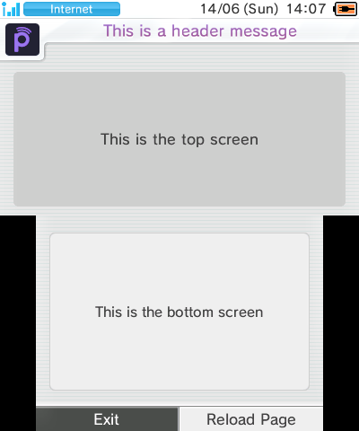

# Assorted patches for Nintendo Network ID Settings (2DS/3DS)

**PLEASE READ: These patches are unfinished and not affiliated with the actual Pretendo Network!** This repo exists only for the sake of demonstrating the extent to which it may be possible to mod this application.

1. Edits the header that indicates which page the user is on, drawn by the app on top of the embedded HTML page
- Changes the colour of the header text
- Replaces the Nintendo Network branding/icon
- This mod does work on a real console and on emulator! But it cannot know which network you have selected in Nimbus, though...
- To build this mod, open the contents of the NAND `act` application in GodMode9, navigate to `layout/sysinfo`, and copy the `AccountHeader.arc` file from it into the repository folder:
  - EUR: 000400100002C100
  - USA: 000400100002C000
  - JPN: 000400100002BF00

2. Edits the embedded HTML content
- Reduces the entire app down to just a single skeleton page
- At this time, this mod can only be loaded in an emulator via the `%APPDATA%/Azahar/load/mods` folder mechanism:
	- copy `index_EU_English.html` from the `data/www` folder into `%APPDATA%/Azahar/load/mods/0004001B00018002/romfs`
- I don't know of a safe way to use it on a real console (LayeredFS seemingly doesn't work for this?)

3. Patches the application's `code.bin`
- ???

## Developer's checklist
- [ ] Polish the dependencies/tooling
- [ ] Create a mod that completely removes the Network branding/icon in the header
- [ ] Figure out a safe way to patch the embedded HTML on a real 3DS
- [ ] Figure out how to change the user's email and country/region information
- ???

## Dependencies and tools imported (TODO - subject to change!)

- flips and armips
- [bclimtool](https://github.com/dnasdw/bclimtool) for converting a .png image to .bclim
- [darctool](https://github.com/LITTOMA/darctool) for extracting/creating DARC
- [auracomp](https://github.com/Venomalia/AuroraLib.Compression) for (de-)compressing files using LZ10

## Credits

TODO
